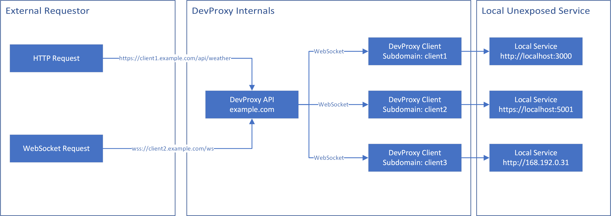

# AwoDevProxy


DevProxy allows you to connect your localhost projects temporarily to the internet


## How does it work?


DevProxies works by giving you a unique subdomain on the public api server. All requests to this subdomain will then be forwarded to the locally running DevProxy Client which then will call your local service, returning the results to the API.
The Client will open an outgoing WebSocket to the Api so no portforwarding on the client side is necessary

## Security
Since this project was just build as a weekend project security wasn't my primary concern. 
Internally the client just uses the local url as the BaseUrl in .NETs HttpClient, i don't know if there are any escapes where one can circumvent this (maybe by setting custom headers)
If you know more about this or want to help me improve the security open an issue or contact me under aeolin@aeol.in

## Compilation
First install .Net 8 SDK [Install Instructions](https://github.com/dotnet/core/blob/main/release-notes/8.0/install.md)
Then just run `dotnet publish -c Release` inside the root folder

## Client Usage
To install the client either copy the compilation output of AwoDevProxy.Client to your /bin folder on linux or C:\Windows\system32
For linux also an install script `install-client-linux` is included in the repo which updates / installs the client into `~/.local/bin/devprxy`

```sh
devprxy --proxy wss://devproxy-public-api.com --name my-subdomain --local http://localhost:1302 --key api_key-1234 --server-timeout 0:1:30 --try-reopen 
```

The client supports the following arguments (also available under `devprxy --help`)
| Argument          | Description                                                               |
| ----------------- | ------------------------------------------------------------------------- |
| --proxy           | Address of the public api the client should connect to                    |
| --local           | Address of the local service the client should proxy requests to          |
| --name            | The name of the subdomain the client should be accessible under           |
| --key             | Api key for the public Api                                                |
| --server-timeout  | After how much time the public Api should handle the request as timed out |
| --try-reopen      | Automatically try to reopen the connection to the api when it was lost    |
| --buffer-size     | How large the local read buffer should be, defaults to 2kb                |

## Server Usage
For Server deployment use the supplied Dockerfile in `AwoDevProxy.Api` or the supplied compose file
The Api will also use Environment Variables as configuration parameters with the default asp.net mapping (ProxyConfig.FixedKey -> PROXYCONFIG__FIXEDKEY)

The Api understands the following config parameters
```json
  "ProxyConfig": {
    "FixedKey": "3@rkRdrki^v@aB^@pDF6LgGgC%^6X9UU",
    "MaxTimeout": "0:5:00",
    "DefaultTimeout": "0:0:30",
    "Domains": [
      "my-domain.com",
      "sudomain.other-domain.com"
    ]
  }
```

| Parameter      | Description                                                                                                                                                                                       |
| -------------- | ------------------------------------------------------------------------------------------------------------------------------------------------------------------------------------------------- |
| FixedKey       | This parameter sets the api key the client is requested to send on connection                                                                                                                     |
| MaxTimeout     | The maximum allowed timeout a client can request, if the client requests a longer value MaxTimeout is used instead                                                                                |
| DefaultTimeout | The default timeout which is used when the client doesn't specify                                                                                                                                 |
| Domains        | Array of domains which the server should use for forwarding, if the domain contains a subdomain, the server expects the client name to be the first parameter (client-name.subdomain.exmaple.com) |

### Docker installation
1. install docket [Docker Guide](https://docs.docker.com/engine/install/)
2. adjust the settings in `docker-copmose.override.yml` 
3. run `docker compose build`
4. run `docket compose up -d`

## Motivation 
I know Microsoft DevTunnels exists, allowing greated flexibility. Altough you have to use microsoft tools to use it and you can't lock it do one service specifically.
This Projects aims to be an self hostable alternative with it's main focus for easy access to services in environments where one can't easily forward or open ports.
